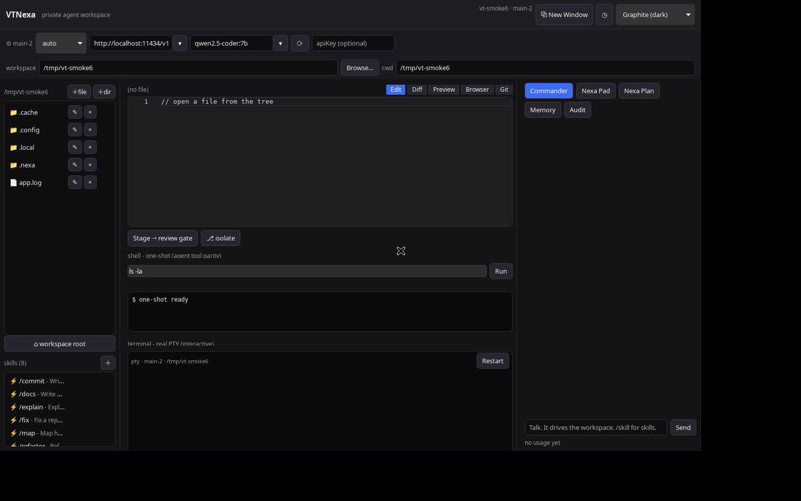

# VTNexa

**A private, review-gated agentic workspace for your code.** A desktop app
(Tauri v2 + React) where a tool-calling agent drives your workspace — and
*nothing* writes, runs, or clicks without your explicit approval.



Run it fully offline against Ollama, or point it at any OpenAI-compatible
endpoint, Anthropic, or Gemini. Your API keys live in the OS keychain. Your
files stay yours. No telemetry, no accounts, no cloud round-trip you didn't
choose.

## Why this exists

Most coding agents either (a) ask for permission on every keystroke or
(b) quietly edit your repo and hope for the best. VTNexa takes a third path:

- **The agent proposes, you dispose.** File edits land in a side-by-side Diff
  view. You approve each one (optionally with an instant commit). Shell
  commands, browser actions, renames, deletes and commits pop an approval
  dialog — with a warning when a command looks like it escapes the workspace.
- **Local by default.** `ollama pull qwen2.5-coder:7b` and you have a private
  coding agent. Switch models per window — grind with a cheap local model in
  one window, think with a frontier model in another.
- **Every window is its own app instance.** Independent workspace folder,
  provider, terminal, chat history, and audit trail. `⧉ New Window` (or just
  launch the app again) opens a sibling.
- **Full transparency.** Per-window token counts, estimated cost, tool
  timing, and a persisted audit log of every tool call and your decision on
  it.

## Features

- **Commander** — tool-calling agent: list/read/search files, propose diffs,
  run shell commands, typecheck edited files (`lsp_diagnostics`: tsc/cargo need
  approval, py_compile is free) and query language servers (`lsp`: hover,
  definition, references, symbols — PATH servers auto-approved, workspace-local
  servers need approval), drive a real Chromium browser (navigate, click, type,
  screenshot with vision), and commit to git — all behind the review gate
  (frontend modal + backend single-use tokens). Long shell work (installs,
  builds, test suites) runs as background jobs (`shell_bg` + `shell_poll`, same
  screening as foreground); turns that run out of budget offer a ▶ Continue
  button over full history. **Plan mode** (◔ toggle or per-turn) restricts it
  to read-only tools for investigation-first flows; routines always run Build.
- **Undo** — approved writes, renames and file deletes are captured
  (↩/↪ buttons, `/undo` `/redo` in chat). Shell/terminal, directory deletes
  and files over 256KB are out of scope; the stack resets on reload.
- **Editor** — Monaco with tabs, live markdown/HTML preview, and a Diff view
  that is also the approval surface.
- **Terminal** — a genuine interactive PTY per window (xterm.js): run dev
  servers, `vim`, `ssh`, whatever you'd do in a terminal.
- **Git tab** — status, per-file diffs, log, commit; approve-&-commit from
  the gate.
- **Nexa Pad / Plan / Memory** — shared notes and durable cross-session
  context the agent reads and writes (`<workspace>/.nexa/`).
- **Skills** — 9 ready-made slash commands (`/commit`, `/review`, `/explain`,
  `/map`, `/fix`, `/refactor`, `/test`, `/docs`, `/scaffold`); add your own
  as markdown files. Project `AGENTS.md`/`CLAUDE.md` is loaded every turn.
- **Routines** — scheduled agent runs with a 15-minute minimum interval.
- **Browser Use** — persistent Chromium profile (signed in as you) the agent
  can operate with your approval; screenshots come back as vision input.
- **MCP (early, opt-in)** — local-stdio and remote-HTTP MCP servers from
  `vtnexa.json` (`~/.config/vtnexa/vtnexa.json` +
  `<workspace>/.vtnexa/vtnexa.json`, see `.vtnexa/vtnexa.json.example`).
  Toggle + per-server status in the ⛁ panel; tools appear as
  `mcp_<server>_<tool>`, always require approval. Remote auth is static
  headers with `{env:...}` substitution (never commit tokens), or OAuth browser
  sign-in from the ⛁ panel (tokens in the OS keychain, silent refresh).

## The 👍 / 👎 buttons (what they do)

Every Commander answer has 👍 and 👎 buttons. Honest explanation:

- Clicking one saves a private note on your machine only: what you asked,
  what it answered, which model answered, and good/bad. Nothing leaves your
  computer, the model never sees your rating, and clicking changes nothing
  by itself.
- So why do they exist? The notes are evidence. When answers are bad on a
  particular model, the pattern (missed tool calls, invented file states,
  false "I can't run commands") tells the developers exactly what guardrail
  to build next — approval gates, self-correction loops, and simpler
  instructions for weaker models all came from reading real bad answers.
- You can safely ignore the buttons and lose nothing. But if Commander gives
  a wrong answer, a 👎 with that trace is the most useful bug report you can
  file — it captures the prompt, the answer, and the model in one entry.

## Install

**Linux (deb):** grab the latest release `.deb` and `sudo dpkg -i`.

**From source:**

```sh
# prereqs: Node 20+/pnpm, Rust, and Tauri's system deps
# (Debian/Ubuntu: libwebkit2gtk-4.1-dev libgtk-3-dev libsoup-3.0-dev)
pnpm install
pnpm tauri dev        # run from source
pnpm tauri build      # produce .deb / AppImage
```

**Model:** start Ollama (`ollama serve`, `ollama pull qwen2.5-coder:7b`) or
paste any provider's baseUrl + key into the provider bar. Tip: pick a model
that handles tool calling well (`qwen2.5:7b-instruct`, `llama3.1:8b`,
`qwen2.5-coder:32b`); VTNexa also recovers tool calls printed as plain text.

## Security model (honest version)

This section documents exactly what is and isn't protected. Read it carefully.

### ✅ What IS protected

- **Approval is the gate.** Side-effecting agent tools (shell, browser actions, rename/delete, commit) pop a native OS dialog — page content cannot click it. Direct buttons (Diff Approve, Git commit) approve by the click itself. Read-only tools run free.
- **Workspace confinement.** File tools are confined server-side to the workspace root you pick (per window), with symlink-safe checks and a sensitive-path deny list.
- **Secrets.** API keys go to the OS keychain (per endpoint+model), never to session files or the workspace. Without a keychain daemon they fall back to app-local storage and the UI says so.
- **Destruction patterns blocked.** The backend refuses obviously destructive shell patterns (`rm -rf /`, `mkfs`, `dd`, `curl | sh` pipe downloads to shell) and direct reads of credential material (`~/.ssh`, AWS creds, `/etc/shadow`).

### ⚠️ What is NOT sandboxed

**This is the critical limitation: Approved commands run as your OS user with your full permissions.**

- The interactive terminal (PTY) has NO screening - it's your shell.
- `curl ... | sh` is allowed in the backend but WARNINGED in the native approval dialog - it's how many toolchains work.
- The backend screening is a *backstop against blind clicking*, not a sandbox. It catches patterns, not obfuscation.
- If you approve a command that does `curl | sh` or runs arbitrary code, that code runs with your permissions.

### Recommendation

Treat every "Approve" click as a commitment to trust what the agent is doing. Read the native dialog carefully (including sandbox-escape warnings). The agent should explain what it needs to run before asking for approval. Treat unexpected dialogs as hostile and reject them.

Found a vulnerability? See [SECURITY.md](SECURITY.md).

## CLI

```
vtnexa --version     show version
vtnexa --help        options + skill list
vtnexa --uninstall   remove a per-user install
```

## Development

```sh
pnpm test            # ~285 vitest tests (jsdom) + coverage via vitest.config.ts
pnpm build           # tsc + vite
cargo test --manifest-path src-tauri/Cargo.toml --lib   # 56 Rust tests
pnpm install-local   # build .deb + install per-user (no sudo)
```

Architecture: thin React components → domain hooks (one window = one
workspace) → Tauri commands in `src-tauri/src/lib.rs` (sandbox, approvals,
git, shell, PTY, keychain) → Playwright sidecar for Browser Use. Details in
`docs/architecture.md`; changes in `CHANGELOG.md`.

## Contributing

Issues and PRs welcome — see [CONTRIBUTING.md](CONTRIBUTING.md). Early
project: expect rough edges, label experiments accordingly.

## License

Apache-2.0 — see [LICENSE](LICENSE).
